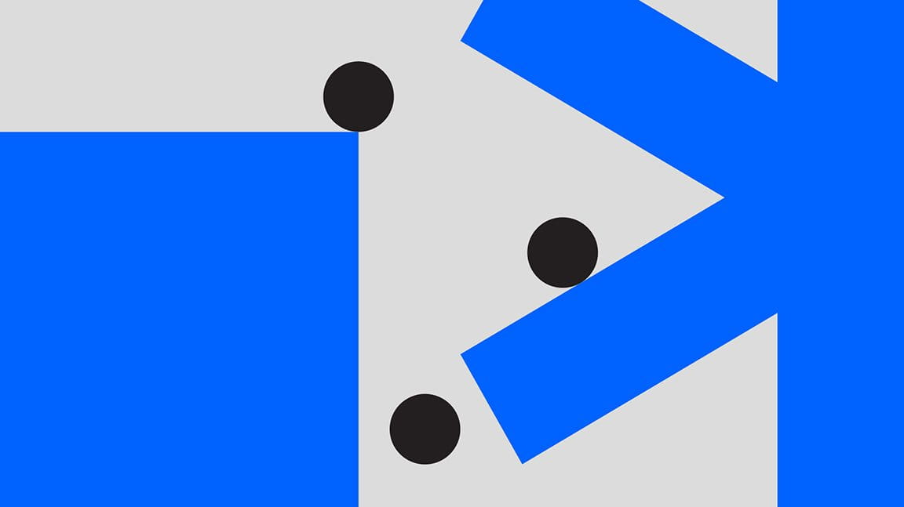

<PageDescription>

</PageDescription>

## UI/UX & Product work

### Ubuntu Touch
 `Netlify` `Gridsome` `Vue.js` `Bootstrap/SCSS` `Figma`

Ubuntu Touch is a mobile version of the Ubuntu operating system, developed by the UBports foundation. Its user interface is written in Qt, and is designed primarily for touchscreen mobile devices.

- [Brand Assets](https://www.figma.com/file/4f23TTErgyU4MrJAlaiyLw/BrandDeck?node-id=0%3A1) & more
- [Ubuntu Touch website](https://ubuntu-touch.netlify.app/) & the Deverloper's Ports (:desktop_computer:)
- [V3 release post](https://hackmd.io/B_ek3zwYQPiv6sw6y4ROSw?view)

## Beyond Benefits
`Figma` `React` `Product`

'[Beyond Benefits](https://youtu.be/QvLN4_XvvA8?t=11)' was an early-day startup that aimed to empower employees in a corporate environment by providing a wide range of lifestyle activities and services, seeking to build a one-stop-shop to offer concierge and well-being services based on company, team, and individual preferences.

I joined the founding team as their first design team member to build and ship an evergreen product.
- [B2B Platform](https://hackmd.io/ALpBCH0xTeecIqHkJB-wRA?view) (Research case)
- [Dashboard](https://www.figma.com/file/KTGXIQRkrUiJcXSkl02VmW/Beyond-Benefits-DS?node-id=0%3A1) (:desktop_computer:)

## Wint Wi App
`Design` `UX`

[Wint.ai](https://wint.ai/) detects and stops leaks at the source using Artificial Intelligence. It alerts you when water is leaking and automatically shuts it off. Intelligent real-time monitoring identifies sources of leaks and waste, reducing your water consumption and preventing damage.

- [UX Research & App Design](https://hackmd.io/Pxt5KWw5SbyJs4BS0HB7BA?view)
- [App Store](https://apps.apple.com/us/app/wint-water-intelligence/id1475760554)

## PlusCard
`Design` `UX` `Mobile App`

PlusCard is a virtual credit card with built-in rules to control employee spending, eliminate reimbursement, and minimize corporate expense policies. My mission was to keep users satisfied and happy.
- [Design Process](https://www.sketch.com/s/bd0a8f8c-8c06-4382-9339-0a070525a2bf/a/PLybz1)
- Mobile App [Download](https://apps.apple.com/us/app/plus-finance-card/id1580087263)

## Linkedin recommendations:
#### :arrow_right: [Watch on Linkedin](linkedin.com/in/eyal4all/)
#### :arrow_right: [Random Visuals on Behance](https://www.behance.net/EyalBenvenisti)

#### :arrow_right: [GitHub](https://github.com/eyalbenvenisti)

###### tags: `Introduction`

<AnchorLinks>
  <AnchorLink>Building bonds</AnchorLink>
  <AnchorLink>Global accessibility standards</AnchorLink>
  <AnchorLink>Small anchor links</AnchorLink>
  <AnchorLink>Videos</AnchorLink>
</AnchorLinks>

<Row>
<Column colMd={4} colLg={4} noGutterMdLeft>
<ArticleCard
  title="Getting started"
  href="/getting-started"
  actionIcon="arrowRight"
>

</ArticleCard>
</Column>
<Column colMd={4} colLg={4} noGutterMdLeft>
<ArticleCard
  title="Theme configuration"
  href="/guides/configuration"
  actionIcon="arrowRight"
>

</ArticleCard>
</Column>
<Column colMd={4} colLg={4} noGutterMdLeft>
<ArticleCard
  title="Contributions"
  href="/contributions"
  actionIcon="arrowRight"
>

</ArticleCard>
</Column>
</Row>

<PageDescription>

Prow scuttle parrel provost Sail ho shrouds spirits boom mizzenmast yardarm.
Pinnace holystone mizzenmast quarter crow’s nest nipperkin grog yardarm hempen
halter furl. Swab barque interloper chantey doubloon starboard grog black jack
gangway rutters.

</PageDescription>

Prow scuttle parrel provost Sail ho shrouds spirits boom mizzenmast yardarm.
Pinnace holystone mizzenmast quarter crow’s nest nipperkin grog yardarm hempen
halter furl. Swab barque interloper chantey doubloon starboard grog black jack
gangway rutters.

<Row>
<Column colMd={5} colLg={8}>

## Section heading

Prow scuttle parrel provost Sail ho shrouds spirits boom mizzenmast yardarm.
Pinnace holystone mizzenmast quarter crow’s nest nipperkin grog yardarm hempen
halter furl. Swab barque interloper chantey doubloon starboard grog black jack
gangway rutters.

> Add-on repositories, or repos, are components built for a specific product or
> experience. The repos are built on top of the core Carbon repo, and enable

IBMers believe in progress—that application of intelligence, reason and science
can improve business, society and the human condition.

</Column>
<Column colMd={2} colLg={3} offsetMd={1} offsetLg={1}>
<Aside>

  <strong>
    Good design is always
     
    good design.
  </strong>

What we borrow from our own design history is not a mid-century aesthetic in
stylistic terms, but the modernist attitudes and approach used at the time.

</Aside>
</Column>
</Row>

## Small anchor links

Swab barque interloper™ chantey doubloon starboard grog black jack gangway
rutters π.

<AnchorLinks small>
  <AnchorLink>Header</AnchorLink>
  <AnchorLink>Header again</AnchorLink>
</AnchorLinks>

### Header

Prow scuttle parrel provost Sail ho shrouds spirits boom mizzenmast yardarm.
Pinnace holystone mizzenmast quarter crow’s nest nipperkin grog yardarm hempen
halter furl. Swab barque interloper chantey doubloon starboard grog black jack
gangway rutters.

### Header again

Prow scuttle parrel provost Sail ho shrouds spirits boom mizzenmast yardarm.
Pinnace holystone mizzenmast quarter crow’s nest nipperkin grog yardarm hempen
halter furl. Swab barque interloper chantey doubloon starboard grog black jack
gangway rutters.

1. This is a demonstration of an ordered list item. This list item is
   particularly long to demonstrate how the text wraps and aligns with the first
   line.
   1. This is a nested list item, it should wrap in the same way. Typically,
      nested list items should be of the same type (ordered, unordered) as their
      parent.
1. Ordered list item
1. Ordered list item

- This is a demonstration of an unordered list item. This list item is
  particularly long to demonstrate how the text wraps and aligns with the first
  line.
  - This is a nested list item, it should wrap in the same way. Typically,
    nested list items should be of the same type (ordered, unordered) as their
    parent.
- Unordered list item
- Unordered list item

## Images

## Videos

<Video title="Eyes" vimeoId="310583077" />
